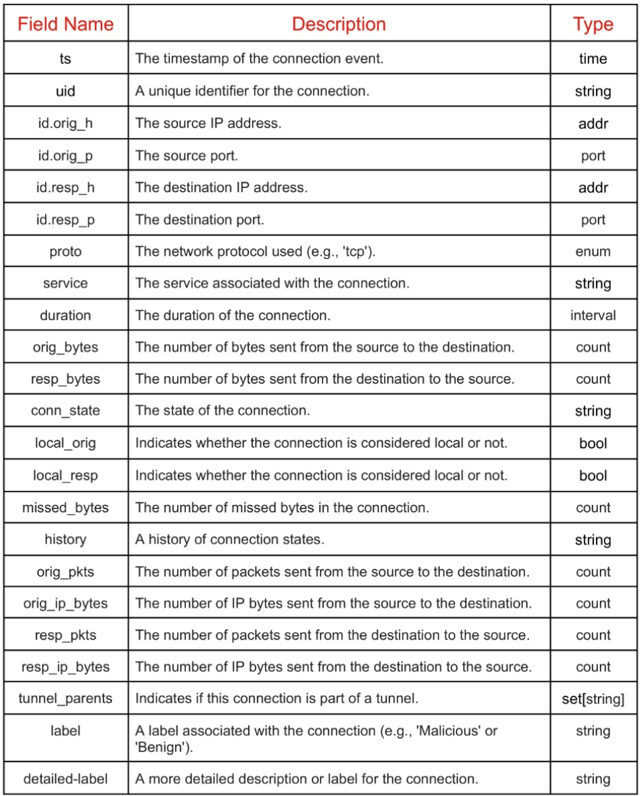
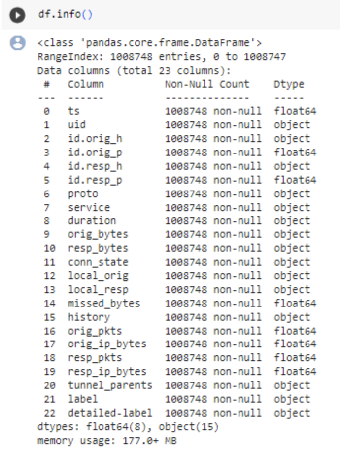
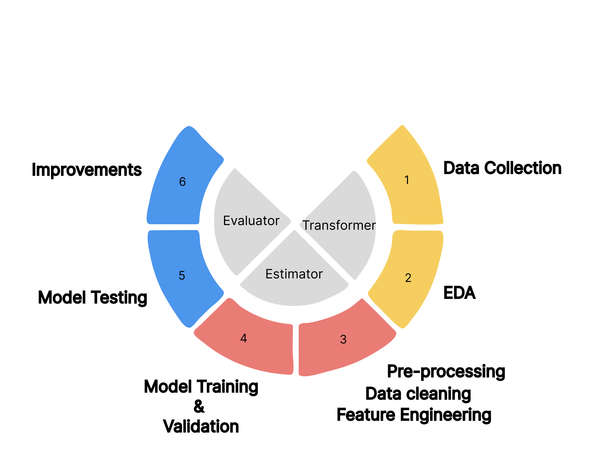
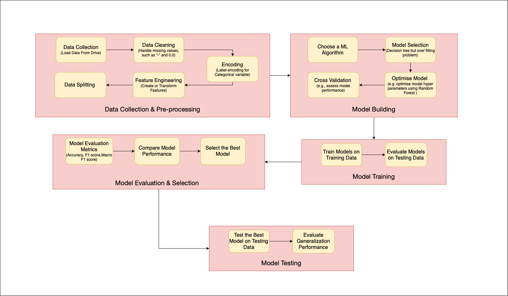
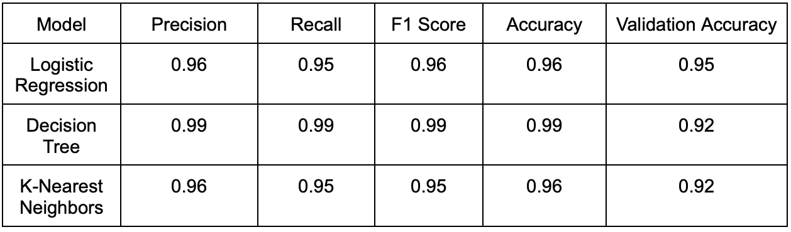
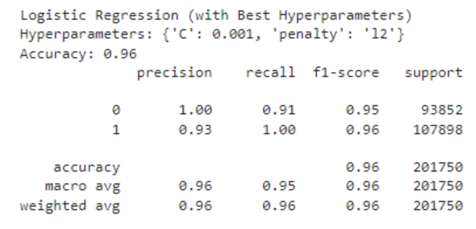

# [Malware Detection in Network Traffic Data](https://www.kaggle.com/datasets/agungpambudi/network-malware-detection-connection-analysis/data?select=CTU-IoT-Malware-Capture-1-1conn.log.labeled.csv)

This dataset contains labels that describe the connections between data flows associated with potentially harmful or malicious activities. These labels were meticulously generated by the Stratosphere labs through in-depth analysis of captured malware. The aim is to offer network malware researchers and analysts a comprehensive source of information.

**Dataset chosen:** CTU-IoT-Malware-Capture-1-1conn.log.labeled.csv

## Team 12-Gold Diggers

### Individual Contributions:

- Rahul Upadhyay(202218003): Preprocessing and Documentation(20%)
- Muskan Khare(202218037): Preprocessing and Documentation(20%)
- Jatan Sahu(202218061): Modeling(20%)
- Bhoomi Prajapati(202218063): Exploratory Data Analysis(20%)
- Bhargav Vidja(202101201): Exploratory Data Analysis(20%)

## Workflow
flowchart1 and flowchart 2

## Table of Contents

1. [Data preprocessing(preprocessing.ipynb)](preprocessing.ipynb)
2. [Exploratory Data Analysis(EDA.ipynb)](EDA.ipynb)
3. [Model Prediction(modeling.ipynb)](modeling.ipynb)
4. Conclusion

## 1&2. Exploratory Data Analysis (EDA) & Preprocessing:

### T1. Explore the dataset assigned to your team and provide:

### **a) Summary of the dataset**
(Include information columns present, attribute types, null values, and a summary of each attribute)

**Dataset chosen:** [CTU-IoT-Malware-Capture-1-1conn.log.labeled.csv](https://www.kaggle.com/datasets/agungpambudi/network-malware-detection-connection-analysis/data?select=CTU-IoT-Malware-Capture-1-1conn.log.labeled.csv)

**Dataset Description**
information about columns present and their description:
  

- Number of rows: 1008748
- Number of columns: 23
- Data summary:(specifying non-null values and datatypes of each column)
  

### **PREPROCESSING:**
  * Checked data types, ensuring each attribute was correctly interpreted.
 
  * Addressed null values:
 
    - Removed rows with a high percentage of missing values to maintain data quality.
  
    - Imputed missing values in columns with a moderate number of missing values, using the mean of the respective column for imputation.
 
  * Encoded categorical columns into numerical values, making the data suitable for machine learning algorithms.
 
  * Employed feature selection techniques and tree-based algorithms to determine feature importance scores, enabling the identification of attributes with the most significant impact on the target variable.

#### **b) Data Visualization**
(summarizing insights about the dataset through EDA)
 
 - **Missing Values Check:** We initially examined the presence of missing values, focusing on attributes with values such as '0.0' or '-'. We visualized and quantified these missing values to better understand their distribution.
 
 - **Distribution of Attributes:** We explored the distribution of attributes in the dataset, paying specific attention to the 'proto' and 'label' columns after preprocessing. This helped us gain insights into the dataset's composition.
 
 - **Box Plots:** We used box plots to visualize the distribution of data across different attributes, providing a clear view of data spread and potential outliers.
 
 - **Classification Accuracy:** Our EDA highlighted that the model exhibits high accuracy (100%) in classifying network traffic as "Benign" when the traffic is of type UDP or ICMP. However, for TCP traffic, there's a challenge due to data imbalance, resulting in a tendency to classify it as malicious when labeled as 'proto=tcp'.
 
 - **Feature Relations:** We identified a high correlation among the 'id.resp_p', 'proto', and 'history' columns. To maintain model accuracy, we decided to retain only the 'history' column, as keeping all three could affect the model's performance.
 
 These insights provide a valuable foundation for further analysis and modeling, guiding decision-making regarding feature selection and model building.

## 3. Classification Analysis:

### T2. Identify and list classification problems on your assigned dataset. Which one does seem the most interesting to you and why?
**Classification Problems:**
 
  - 'proto' Classification: Identifying the network protocol used in each connection, allowing for insights into communication channels during intrusion activities.
  
  - 'label' Classification: Categorizing activities as 'malicious' or 'benign,' enabling the automatic detection and response to potentially harmful network activities.

**Interest in 'label' Classification:**

 - **Real-world Impact:** Detecting and classifying malicious activities in network security has direct real-world applications and implications, enhancing system security.
 
 - **Challenge and Innovation:** Classifying 'label' is intriguing due to the ever-evolving nature of security threats. It presents an opportunity for innovation in cybersecurity by addressing data imbalance, exploring new features, and adapting to emerging threats.

### T3. Build an end-to-end Machine Learning pipeline.
  
  

The machine learning pipeline comprises key stages. It begins with data splitting and standardization, where we divide the dataset, standardize it, and move to model selection. In this stage, we consider models like linear regression, polynomial regression, Ridge regression, k-Nearest Neighbors (kNN), and Random Forest.
Models used for Evaluation

**Model 1:** Logistic Regression 

**Model 2:** Decision Trees

**Model 3:** K-nearest Neighbors
  
  
Decision Tree works better but there it might be overfitting so will use Random forest in the overfitting case.
  

final result

Subsequently, hyperparameter tuning and model evaluation optimizes model hyperparameters using GridSearchCV, with evaluation on the validation set. Selecting the best model and evaluating on the test set follows, where the top-performing model on the validation set is assessed on an independent test dataset. Finally, model comparison showcases results, highlighting the best hyperparameters and critical metrics like Precision, Recall, and Accuracy Score. These stages encompass data preparation, model selection, and thorough evaluation.

